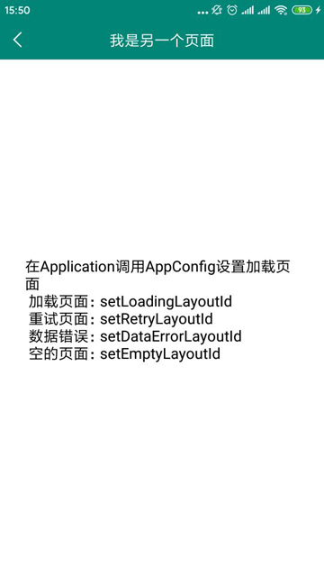

# base
1. 项目的基本库，为快速开发项目提供基础。
2. AppConfig用这个类来配置通用的配置。

### 引入

```
allprojects {
		repositories {
			...
			maven { url 'https://jitpack.io' }
		}
	}

// 阿里的ARouter 运行时编译工具
apply plugin: 'com.alibaba.arouter'

android {
    ...
    defaultConfig {
        ...
        // 阿里的ARouter API注解编译用
        javaCompileOptions {
            annotationProcessorOptions {
                arguments = [AROUTER_MODULE_NAME: project.getName()]
            }
        }

    }
    ...
    // 解编配置
    compileOptions {
        sourceCompatibility JavaVersion.VERSION_1_8
        targetCompatibility JavaVersion.VERSION_1_8
    }
}


implementation "com.github.wenkency:base:1.0.0"
// 阿里ARouter
annotationProcessor "com.alibaba:arouter-compiler:${versions.arouterCompiler}"

```

### 使用方式

```
@Route(path = "/b/videos")
public class TestActivity extends AppActivity {
    // 阿里路由注入
    @Autowired
    String path;
    TextView tv;


    @Override
    protected Object getContentLayout() {
        return R.layout.activity_test;
    }

    @Override
    protected void initTitle(DefTitleBar titleBar) {
        titleBar.setTitle("我是另一个页面");
    }

    @Override
    protected void initViews(View view) {
        ARouter.getInstance().inject(this);
        tv = findViewById(R.id.tv);
        tv.setText(path);
    }

    @Override
    protected void initNet() {
        showLoading();
    }
}

```

### 运行结果


